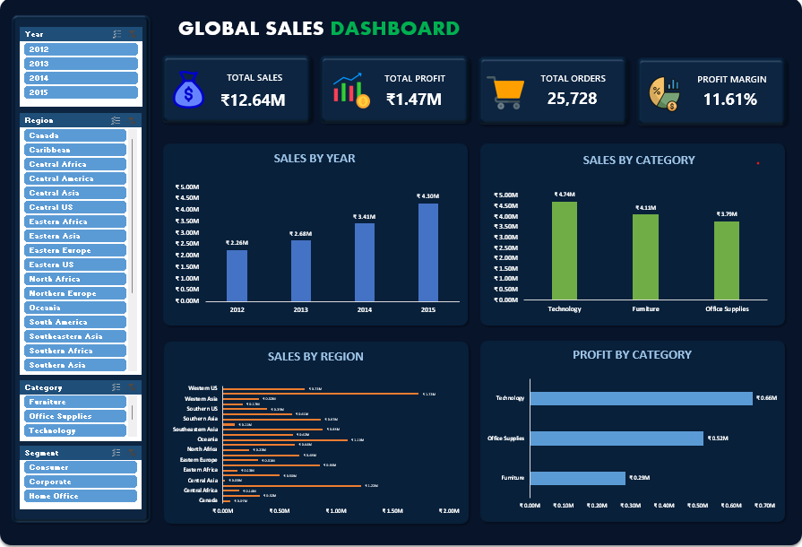

 📊 Global Sales Analysis — Excel

📌 Project Overview

This is an end-to-end **Global Sales Analysis project using Microsoft Excel**. The project analyzes sales data to understand business performance, identify profitable areas, and generate actionable insights.

The project covers the complete data analytics process, including **data cleaning, analysis, KPI creation, data visualization, and dashboard development**.

---

🎯 Business Objective

The main objective of this project is to analyze global sales data and answer important business questions such as:

* Which regions generate the highest sales?
* Which categories are performing well?
* Which products are most profitable?
* How does sales performance change over time?
* Which areas contribute most to overall profit?
* What are the key trends and patterns in the sales data?

---

 🛠️ Tools & Skills

* **Microsoft Excel**
* Data Cleaning
* Excel Formulas
* PivotTables
* Pivot Charts
* KPI Analysis
* Data Visualization
* Interactive Dashboard
* Business Insights

---

📂 Project Structure

```text
Global-Sales-Analysis/
│
├── README.md
├── Global_Sales_Analysis.xlsx
├── Global_Sales_Dashboard.png
└── Global_Superstore.csv
```

---

 🔄 Project Workflow

1. Raw Data

The original sales dataset was imported into Excel for analysis.

2. Data Cleaning

The data was cleaned and prepared for analysis by:

* Checking for missing values
* Removing duplicate records
* Cleaning inconsistent data
* Formatting columns correctly
* Preparing data for analysis

3. Data Analysis

Created an analysis section using Excel to explore:

* Sales performance
* Profit performance
* Regional performance
* Category performance
* Product performance
* Sales trends

4. KPI Analysis

Created key performance indicators such as:

* **Total Sales**
* **Total Profit**
* **Total Orders**
* **Profit Margin**

5. Charts & Visualization

Created charts to understand:

* Sales by Region
* Sales by Category
* Profit by Region
* Monthly Sales Trends
* Product Performance

6. Dashboard

Built an interactive Excel dashboard that combines KPIs, charts, and filters to provide a quick overview of business performance.

---
📊 Dashboard Preview



---

💡 Key Insights

* The analysis identifies the strongest-performing regions based on sales.
* Regional performance can be compared to understand where the business generates the most revenue.
* Category-level analysis helps identify important product categories.
* Profit analysis highlights differences between sales performance and actual profitability.
* The dashboard provides an interactive way to explore overall sales performance.

---

📚 What I Learned

Through this project, I improved my practical skills in:

* Data cleaning
* Excel formulas
* PivotTables
* Data visualization
* KPI creation
* Dashboard development
* Business analysis
* Communicating data-driven insights

---

🚀 Future Improvements

I plan to recreate this analysis using other data analytics tools such as:

* **SQL**
* **Python**
* **Power BI**

This will help compare different approaches to solving the same business problem.

---

👨‍💻 Author

**Mohammed Azhan**

Aspiring Data Analyst

**Skills:** Excel | SQL | Python | Power BI

---

⭐ If you find this project useful, feel free to explore the files and dashboard.
